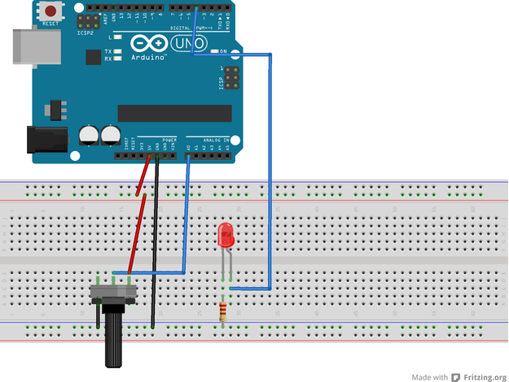

##  **PRACTICA 3. CONTROLAR EL BRILLO DE UN LED CON UN POTENCIOMETRO**  

### **Objetivo:**
Controlar la intensidad del brillo de un LED mediante un potenciómetro. Aprender a usar los pines analógicos de Arduino. Encender un LED y cambiarle su intensidad usando PWM, señales de modulación de ancho de pulsos.

### **Descripcion:**
 1. Conectamos un LED a nuestra protoboard. 
 2. La parte redonda el LED la conectamos al pin 3 de nuestro Arduino.
 3. Conectamos una resistencia de 220 0 330 ohm a la parte plana del LED.
 4. Conectamos la resistencia a tierra. 
 5. Ahora es tiempo de conectar nuestro potenciómetro, lo colocamos en la  protoboard. 
 6. Viendo el potenciómetro de frente, el pin del extremo izquierdo lo conectamos a tierra y el del extremo derecho 5v. 
 7. El pin central de nuestro potenciómetro lo conectamos al pin 3 A0 de la sección digital de nuestro Arduino. 
 8. Ahora cargamos el código para ver los resultados.      
 
 **Aclaración:** Es importante que sea el pin 3 ya que es una salida analógica, aunque la Arduino UNO cuenta con otros pines analógicos aparte del 3, estos el 5, 6, 10 y 11, se les puede reconocer por el signo ~ que les antecede.
 
### **Materiales:**
-	1 Arduino UNO R3.
-	1 Protoboard. 
-	1 Led Rojo 5mm. 
-	1 Resistencia de 220ohm o 330 ohm. 
-	1 Potenciómetro de 10K ohm. 
-	Cables de conexión.

### **Montaje:**

Montaje del circuito para controlar el brillo de un led con un potenciómetro.

### **Codigo para Arduino:**

const int led =3;      
const int pot =0;     
int brillo;   

**void setup** ( )    
{   
  **pinMode** (led, OUTPUT);      
}    

**void loop** ( )    
{    
  brillo = **analogRead** (pot) / 4;    
  **analogWrite** (led, brillo);    
}    

